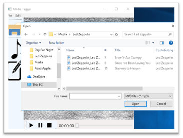

Simple text :- Can be simply typed → Text
Italic text :- Can be typed between pair of Underscores → _text_
Bold text :- Can be typed between a pair of two Asterisk → **text**
Strikethrough :- Can be typed between a pair of two Tilde → ~~text~~

## Project: MP3 Player - used XAML/C# to create a WPF application 

Max size 1 → # Heading 1
Size 2 → ##Heading 2
Size 3 → ###Heading 3
Size 4 → ####Heading 4
Size 5→ #####Heading 5
Min Size 6 → ######Heading 6

### Discription
(-Just add a dash first and then write a text.Need a space follow the sign)
- Allows users to select and play an MP3 audio file
(If you add four spaces or use a tab key, you will create an indented list.)

	- On application start, the user can open a file dialog, browse to an MP3 audio file, and open it. 
	
	- When an MP3 has been opened, the user can use either a menu option or toolbar buttons to control the music’s playback state (**Play**, **Pause** or **Stop**)
	
	
	- After a song is selected, song **metadata** (such as Title, Artist, Album, Year) shall be displayed in a “Now Playing” screen. 
	- Once a song has been selected, the user should be able to **toggle** the display between the “Now Playing” screen and a tag-editing screen.
	

### This project includes the following technical specs:
-   Test
•	WPF application using XAML and C#.
•	Use CommandBindings for the media and application controls
•	Use at least one User Control (Suggested use: Now Playing and/or Tag Editor screens)
•	Use at least three layout managers to create an intuitive and flexible user interface.
•	At minimum, the app should be able to read and write the following tag data: Song Title, Album, Year. Other tags can be used as desired.
•	Implement reasonable exception handling to avoid program crashes.
•	Note: The timer and progress slider shown in the screenshots are nice features to include, but optional.

[Reference article :what-is-readme-md-file](https://www.geeksforgeeks.org/what-is-readme-md-file/)
